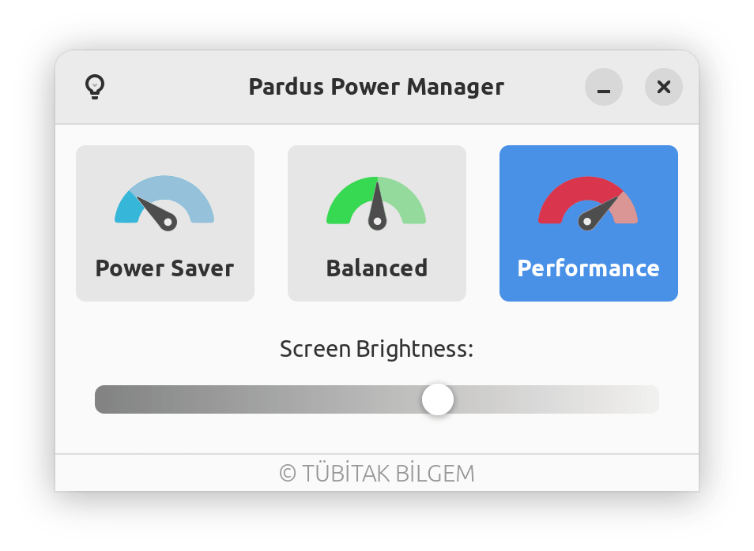
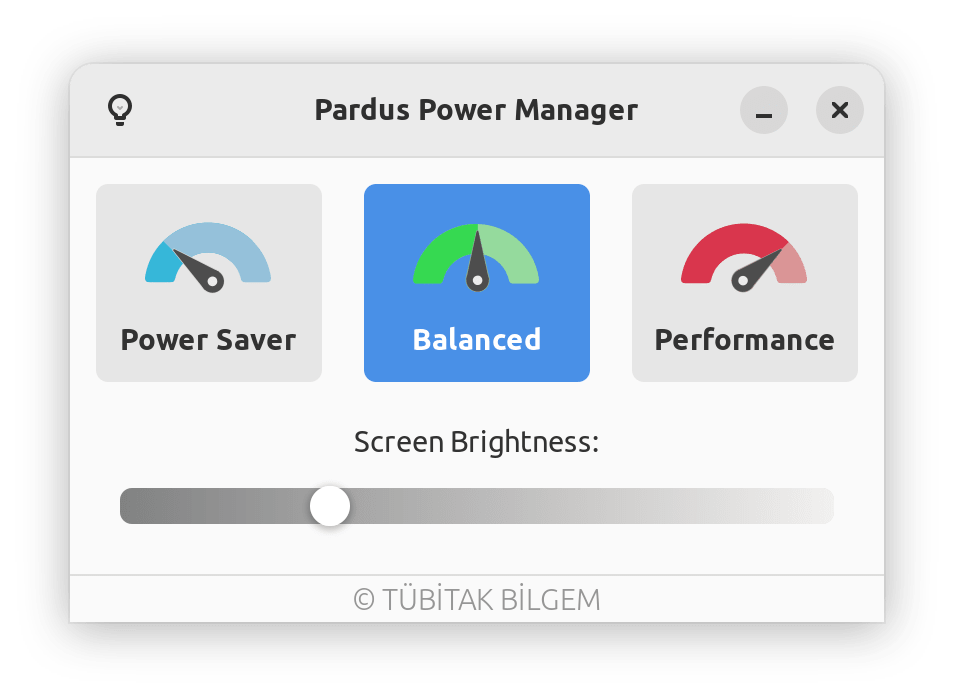

# Pardus Power Manager

Pardus Power Manager is a simple power manager application based on power-profiles-daemon.

It is currently a work in progress. Maintenance is done by <a href="https://www.pardus.org.tr/">Pardus</a> team.

[](https://repology.org/project/pardus-power-manager/versions)

### **Dependencies**

This application is developed based on Python3 and GTK+ 3. Dependencies:
```bash
gir1.2-glib-2.0 gir1.2-gtk-3.0 gir1.2-notify-0.7 gir1.2-ayatanaappindicator3-0.1 power-profiles-daemon
```

### **Run Application from Source**

Install dependencies
```bash
sudo apt install gir1.2-glib-2.0 gir1.2-gtk-3.0 gir1.2-notify-0.7 gir1.2-ayatanaappindicator3-0.1 power-profiles-daemon
```
Clone the repository
```bash
git clone https://github.com/pardus/pardus-power-manager.git ~/pardus-power-manager
```
Run application
```bash
python3 ~/pardus-power-manager/src/Main.py
```

### **Build deb package**

```bash
sudo apt install devscripts git-buildpackage
sudo mk-build-deps -ir
gbp buildpackage --git-export-dir=/tmp/build/pardus-power-manager -us -uc
```

### **Screenshots**




